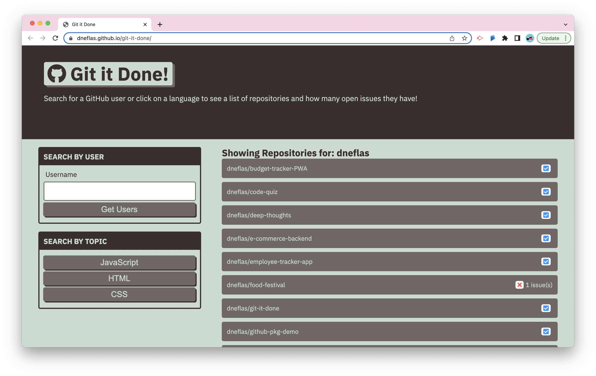

# GIT-IT-DONE

## Description

An application that helps users search GitHub by username or topic, and display matching projects along with the number of open issues they have. The application uses the fetch API to send requests to a GitHub API. It receives and parses data in the JSON format to dynamically generate HTML.

## Built With

- HTML
- CSS
- Javascript
- Bootstrap
- fetch API
- GitHub API

## Deployed Application

https://dneflas.github.io/git-it-done/
